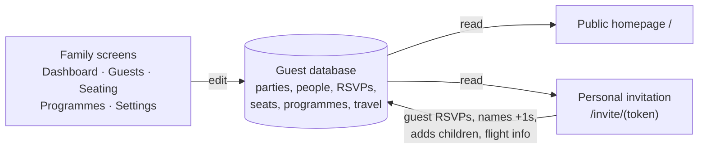

# Roadmap & status

*The project plan: what problem this solves, what is built, what is deferred, what was
decided and why, and what is waiting on Agil. Update this file whenever a phase lands
or a decision is made — it is the single source of truth for project status.*
*(Last updated: 28 August 2026 — 8 weeks before the wedding. The site is LIVE.)*

## The problem

The guest list for Agil & Semra's wedding (23 October 2026, 19:00, Buta Palace, Baku)
lived in one Excel sheet: 234 invited parties / ~387 people in hand-drawn blocks, tallied
by fragile formulas. It could not track RSVPs, phone numbers, seating, or travel — and
only one person could edit it. On top of that, **guests do not all have the same day**:
some gather at the groom's house and travel in convoy, some come straight to the venue,
and guests flying in need their whole visit planned. International guests especially
need to know exactly what to expect.

## How the pieces fit

One database of parties and people; everything else is a view of it.

A party's single record carries its RSVP, table, programme and travel — so the family
edits in one place and the guest's page updates instantly.

## Build phases

| Phase | What | Status |
|---|---|---|
| 0 | Import the spreadsheet (234 parties / 386 seats, zero lost) | ✅ done 8 Aug |
| 1 | Guest list + RSVP: dashboard, guests screen, settings, invite links | ✅ done 8 Aug |
| 2 | Programmes (per-group day plans A/B/C), seating floor plan, public homepage | ✅ done 17–23 Aug |
| 2.5 | Hardening: git + GitHub, 10-test smoke suite, refactor, moved out of iCloud | ✅ done 23 Aug |
| 3 | Deployment — live at wedding-app-mu-ten.vercel.app (Vercel + Neon Postgres, both in Frankfurt); deploys automatically on every `git push` | ✅ done 28 Aug |
| 4 | **Travel/hotels module** — hotel list, room assignments, arrivals/departures board, transfer grouping; feeds Group C invitations | 🔜 next build |
| 5 | Activities — trips for out-of-town guests, sign-up via invite link | ⏳ after travel |

## Family to-do (the app is waiting on these)

| Task | Where | Status |
|---|---|---|
| Confirm the RSVP deadline (currently my placeholder: **1 October**) | Settings | ❗ unconfirmed |
| Rename the imported "Section NN" blocks to real names | Guests → Groups | 17 of 31 still auto-named |
| Assign parties to programmes A/B/C | Guests → tick + "Move to programme" | 232 of 234 still on default B |
| Add phone numbers (needed to send WhatsApp invites) | Guests | 1 of 234 |
| Mark bride's / groom's side per party (optional, helps seating) | Guests | 0 set |
| Replace remaining placeholder text (venue address detail, map link, welcome text) | Settings | partially placeholder |
| Get the real room layout from Buta Palace, then drag tables to match | Seating → Move tables | placeholder layout |
| **Change the admin password** (still the seed default) | live site → Settings | ❗ urgent — site is public now |
| Re-add Ilya Briskman's +1 (his wife) on the live site | Guests → open party → Add member | 1 minute |
| Seat the room | Seating | 2 of 387 |
| Send invitations (WhatsApp, per party) | Guests → Copy invite | waits for travel module |

## Decisions made (and why)

- **One app, one database** — not separate tools per concern; the whole value is seeing a
  party's RSVP + seat + programme + travel in one place. *(early Aug)*
- **A party = one invite link; no guest accounts.** Nobody's grandmother registers. *(8 Aug)*
- **Guests self-serve**: RSVP, name their +1s, add children, send flight details. *(8 Aug)*
- **Programmes**: each party is on exactly one version of the day and sees only that. *(23 Aug)*
- **Seating is plan-first**: seat anyone regardless of reply; reconcile near the deadline
  ("Free their seats" flow). The family knows who is coming; RSVPs are confirmation. *(23 Aug)*
- **Travel lives on the party, not the person** — families travel together; exceptions go
  in notes. *(17 Aug)*
- **Invites delivered by hand over WhatsApp** — no email infrastructure. *(8 Aug)*
- **Hosting: Vercel + managed Postgres**, paid tiers fine ($20–50/mo). *(8 Aug; reaffirmed
  over Azure 23 Aug — "prefer Vercel instead of spending time configuring azure")*
- **Deploy before the travel module** so the family can do data entry from their phones. *(23 Aug)*
- **Test data cleared at the Postgres migration** — production starts from the clean
  spreadsheet import, plus Ilya Briskman's +1 (his wife), Agil's one real edit. *(23 Aug)*
- **English-only guest pages** for now. *(8 Aug)*
- **Boring tech, no black box** (Agil's standing requirement): Next.js + Prisma + SQLite
  → Postgres, minimal dependencies, README as owner's manual, tests as the safety net. 
- **Guest data never goes to GitHub** — code in the repo; database on the laptop plus
  dated backups (one copy in iCloud). *(23 Aug)*

## Deliberately set aside

- Email sending / bulk messaging (WhatsApp by hand is the plan)
- Azerbaijani/Russian translations of the guest pages
- Photo galleries, gift registries
- Per-person travel itineraries (party-level is enough)
- Roles/permissions among family admins (everyone equal)

## Open questions for Agil

1. RSVP deadline — is 1 October right?
2. Bride's side: is Semra's family's list coming into this same app, and who from her
   side gets a family login?
3. Hotels: which ones will we actually offer to Group C guests?
4. Transfers: private drivers, a minibus, or case-by-case?
5. When do invitations go out? (Deployment must land first; working back from the RSVP
   deadline, realistically early–mid September.)
